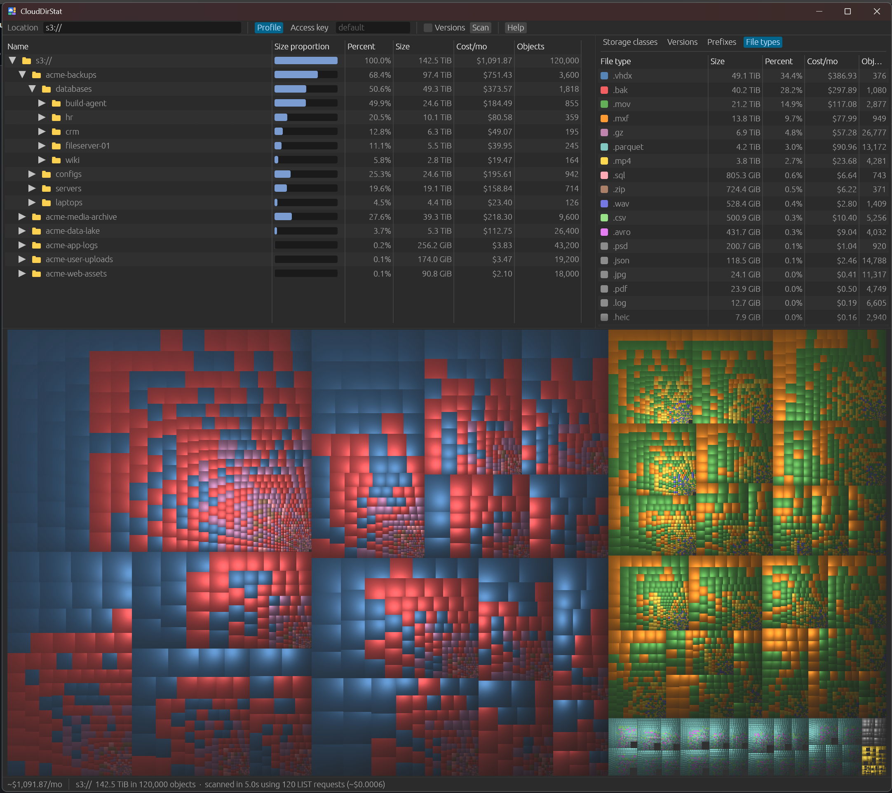

# CloudDirStat

[](https://github.com/hossimo/CloudDirStat/actions/workflows/ci.yml)


**CloudDirStat is like the amazing [WinDirStat](https://windirstat.net/) (not affiliated) for cloud storage.** See what is using the space, and the money, in your Amazon S3, Google Cloud Storage, and Azure Blob Storage buckets.

CloudDirStat lists a bucket (or all of them), rebuilds the folder tree from the object names, and shows it as a sortable folder list and a treemap. Every folder and file shows its size and an estimated monthly cost. It breaks usage down by storage class, file type, and version, and finds storage that costs money but hides from normal listings: old versions, deleted files that are still billed, and abandoned uploads.



*A scan of made-up demo buckets.*

| Provider | Status |
|---|---|
| **Amazon S3** | **Well tested** on real buckets. |
| **Google Cloud Storage** | **New; needs more testing.** Works with Google login, service accounts, and access tokens, but has only been tested on a small test bucket. |
| **Azure Blob Storage** | **New; needs more testing.** Works with the Azure CLI, SAS tokens, and account keys, but has only been tested on a small test account. |

The project is in early development. If a scan fails or shows wrong numbers, please [open an issue](https://github.com/hossimo/CloudDirStat/issues).

**Contents:** [Features](#features) · [Install](#install) · [Quick start](#quick-start) · [Sign in and permissions](#sign-in-and-permissions) · [Using the app](#using-the-app) · [Command line](#using-the-command-line) · [Costs](#costs) · [Troubleshooting](#troubleshooting) · [Roadmap](#roadmap) · [About](#about) · [Contributing](CONTRIBUTING.md)

## Features

- **Folder list and treemap**, sorted by size, with share of the parent folder, cost per month, object count, and last modified date.
- **Largest files** list, per bucket when scanning several.
- **Color and filter** by storage class, version state, top-level folder, or file type.
- **Monthly cost estimates** from each bucket's own regional list prices.
- **Hidden costs:** old versions, deleted files whose old versions are still billed, and incomplete multipart uploads (S3).
- **Every bucket at once:** `s3://`, `gs://`, or `az://` scans them all into one tree.
- **Scan cost up front:** reports what the listing itself cost; for S3, **Estimate** shows sizes and costs in seconds without listing anything.
- **Small and fast:** one native app per platform, no runtime or browser. Lists in parallel and uses about 66 bytes of memory per object (roughly 650 MB for 10 million objects).

### Safe by design

- **Read-only.** CloudDirStat never adds, changes, or deletes anything in your buckets, and never reads the contents of your files. It only lists them.
- **Least privilege.** A scan needs nothing more than permission to list. Optional permissions add features; when one is missing, that feature is skipped with a warning. Each cloud's permissions are listed under [Sign in and permissions](#sign-in-and-permissions).
- **Your keys stay yours.** Keys and tokens typed into the app are kept in memory only: never saved to disk, logged, or sent anywhere but the provider. There is no telemetry.

## Install

Download the latest [release](https://github.com/hossimo/CloudDirStat/releases) for your system:

| System | Download | Contains |
|---|---|---|
| **Windows** (x64 or ARM64) | `clouddirstat-…-windows-msvc.zip` | `clouddirstat-gui` (the app) and `clouddirstat` (the command line) |
| **Linux** (x64 or ARM64) | `clouddirstat-…-linux-gnu.tar.gz` | `clouddirstat-gui` (the app) and `clouddirstat` (the command line) |
| **Mac** (Apple Silicon and Intel) | `CloudDirStat-…-macos.dmg` | The app. Open it and drag **CloudDirStat** to **Applications**. |
| | `clouddirstat-…-macos.tar.gz` | The command line, a separate download (see [On a Mac](#on-a-mac)) |

The programs are not code-signed with a developer certificate yet (see [Code signing needs funding](#code-signing-needs-funding)), so the first start needs one extra step:

- **Windows:** SmartScreen may warn about an unrecognized app. Choose **More info → Run anyway**.
- **Mac:** macOS blocks the app until you allow it once; see below.

If you'd rather not run unsigned programs at all, you can [build from source](CONTRIBUTING.md#building-from-source).

### On a Mac

**Opening the app the first time.** Until CloudDirStat is signed by a registered Apple developer, macOS blocks it the first time you open it and says it can't verify the developer. You only need to allow it once:

- **macOS 15 Sequoia and later:** double-click **CloudDirStat** in Applications and close the warning (**Done**). Then open **System Settings → Privacy & Security**, scroll down to the message about CloudDirStat, click **Open Anyway**, and confirm. (Apple removed the right-click shortcut below in macOS 15.)
- **macOS 14 Sonoma and earlier:** in Applications, right-click (or Control-click) **CloudDirStat**, choose **Open**, then click **Open** again in the dialog.
- **Or, in Terminal**, on any version: `xattr -dr com.apple.quarantine /Applications/CloudDirStat.app`. This removes the "downloaded from the internet" mark that makes macOS check the app before opening it, so only do it for a download you trust (see [Checking a download](#checking-a-download)).

**Installing the command line.** The DMG contains only the app. To use the `clouddirstat` command in Terminal, download `clouddirstat-…-macos.tar.gz` (one program for both Apple Silicon and Intel Macs) and install it:

```sh
cd ~/Downloads
tar -xzf clouddirstat-*-macos.tar.gz        # skip if Safari already unpacked it
cd clouddirstat-*-macos/
xattr -d com.apple.quarantine clouddirstat  # allow it to run (not code-signed yet)
sudo mkdir -p /usr/local/bin
sudo mv clouddirstat /usr/local/bin/        # or any folder on your PATH
clouddirstat --version
```

### Checking a download

Every release file comes with a signed record from GitHub that it was built by this repository's release workflow. To check one, use the [GitHub CLI](https://cli.github.com):

```sh
gh attestation verify clouddirstat-v1.2.3-x86_64-pc-windows-msvc.zip --repo hossimo/CloudDirStat
```

## Quick start

1. **Sign in** to your cloud with its own command-line tool. This is a one-time step; see [Sign in and permissions](#sign-in-and-permissions) for details and for key-based sign-in.

   | Cloud | Sign in once with |
   |---|---|
   | AWS | `aws login` or `aws sso login` |
   | Google Cloud | `gcloud auth application-default login` |
   | Azure | `az login` |

2. **Scan.** Start the app (**CloudDirStat** on a Mac, `clouddirstat-gui` on Windows and Linux), choose **S3**, **Google**, or **Azure**, type the bucket (for example `my-bucket`), and press **Scan**. Or from a terminal:

   ```sh
   clouddirstat scan s3://my-bucket
   clouddirstat scan gs://my-bucket
   clouddirstat scan az://mystorageaccount/mycontainer
   ```

### Locations

A location says what to scan. Everything after the bucket (or container) is an optional folder prefix.

| Location | Scans |
|---|---|
| `s3://my-bucket` | One S3 bucket |
| `s3://my-bucket/logs/2024/` | One folder of a bucket |
| `s3://` | Every bucket your AWS account can see |
| `gs://my-bucket` | One Google Cloud Storage bucket |
| `gs://` | Every bucket of one Google Cloud project |
| `az://mystorageaccount/mycontainer` | One Azure container |
| `az://mystorageaccount` | Every container of a storage account |
| `az://` | Every storage account you can see (Azure CLI sign-in only) |

In the app you don't need to type the `s3://`, `gs://`, or `az://` part: the **S3**, **Google**, and **Azure** buttons next to **Location** put it in for you, and switching between them keeps the rest of the location. Typing or pasting a full location selects the matching button, and an unknown scheme outlines the field in red. A location without a scheme is taken as S3. When scanning several buckets, each one appears as a top-level folder and is priced at its own region's rates; buckets you can't list are skipped with a warning.

## Sign in and permissions

In the app, the sign-in choices to the right of **Location** change with the cloud you choose: **Profile / Access key** for `s3://`, **Google login / Access token** for `gs://`, and **Azure CLI / SAS token / Account key** for `az://`.

Signing in with your cloud's own login is recommended: nothing secret is typed into CloudDirStat, and sessions expire on their own. Keys and tokens work too, for when you can't use a login.

### Amazon S3 (AWS)

**Option 1: sign in with the AWS CLI (recommended)**

1. Install the [AWS CLI v2](https://aws.amazon.com/cli/).
2. Sign in, using either the AWS console login or IAM Identity Center (SSO):

   ```sh
   aws login --profile myprofile          # console sign-in
   aws configure sso                      # SSO: once, to set up the profile
   aws sso login --profile myprofile      # SSO: each time the session expires
   ```

3. Scan with that profile:
   - **App:** choose **Profile** and type `myprofile` (leave it empty for the default profile).
   - **Command line:** `clouddirstat scan s3://my-bucket --profile myprofile`

Any other profile in `~/.aws/config` or `~/.aws/credentials` works the same way, as do the standard `AWS_*` environment variables and EC2/ECS/EKS roles. CloudDirStat uses the same credential chain as the AWS CLI.

**Option 2: access keys**

- **App:** choose **Access key** and enter the access key ID and secret access key, plus the session token if the keys are temporary.
- **Command line:** set the standard environment variables, so the keys stay out of your shell history:

  ```sh
  export AWS_ACCESS_KEY_ID=...
  export AWS_SECRET_ACCESS_KEY=...
  export AWS_SESSION_TOKEN=...   # only for temporary keys
  clouddirstat scan s3://my-bucket
  ```

  (On Windows PowerShell: `$env:AWS_ACCESS_KEY_ID = "..."`, and so on.)

Create keys for an IAM user or role that has only the permissions below.

**AWS permissions**

A ready-to-use minimal IAM policy is in [`docs/iam-policy.json`](docs/iam-policy.json); replace `YOUR-BUCKET` with your bucket name.

| Permission | Needed | For |
|---|---|---|
| `s3:ListBucket` | **Always** | Listing objects and finding the bucket's region |
| `s3:ListBucketVersions` | With **Versions** | Old versions and delete markers |
| `s3:ListAllMyBuckets` | For `s3://` | Finding every bucket |
| `s3:ListBucketMultipartUploads` | Optional | Finding incomplete uploads |
| `s3:ListMultipartUploadParts` | Optional | Sizing incomplete uploads (resource `arn:aws:s3:::my-bucket/*`) |
| `cloudwatch:GetMetricData` | Optional | **Estimate** and the scan progress bar |

### Google Cloud Storage

**Option 1: sign in with gcloud (recommended)**

1. Install the [Google Cloud CLI](https://cloud.google.com/sdk/docs/install) (on Windows: `winget install Google.CloudSDK`).
2. Sign in once:

   ```sh
   gcloud auth application-default login
   ```

3. Scan:
   - **App:** choose **Google login**.
   - **Command line:** `clouddirstat scan gs://my-bucket`

To scan every bucket with `gs://`, CloudDirStat needs to know which project to look in. Type the project ID in the app's **Project** field or pass `--project my-project` on the command line, or set a default once with `gcloud config set project my-project`. `gcloud projects list` shows your project IDs.

**Option 2: an access token**

Tokens last about an hour.

1. Get one with `gcloud auth print-access-token` (or from the [OAuth Playground](https://developers.google.com/oauthplayground) with the scope `https://www.googleapis.com/auth/devstorage.read_only`).
2. Use it:
   - **App:** choose **Access token** and paste it.
   - **Command line:** set `GOOGLE_OAUTH_ACCESS_TOKEN` to the token.

**Option 3: a service account key file**

Set `GOOGLE_APPLICATION_CREDENTIALS` to the path of the key file, then use **Google login** in the app (or no option on the command line). CloudDirStat asks Google for read-only storage access with it. Workload identity federation and impersonated credentials are not supported yet.

**Google permissions**

The **Storage Object Viewer** role covers scanning a bucket. For the optional parts, add the permissions to a custom role.

| Permission | Needed | For |
|---|---|---|
| `storage.objects.list` | **Always** | Listing objects (in Storage Object Viewer) |
| `storage.buckets.get` | Optional | The bucket's location, for prices (otherwise us-central1 prices, with a warning) |
| `storage.buckets.list` | For `gs://` | Finding every bucket of the project |

### Azure Blob Storage

**Option 1: sign in with the Azure CLI (recommended)**

1. Install the [Azure CLI](https://learn.microsoft.com/cli/azure/install-azure-cli) (on Windows: `winget install Microsoft.AzureCLI`).
2. Sign in once:

   ```sh
   az login
   ```

3. Give yourself the **Storage Blob Data Reader** role on the storage account (or container). Being Owner or Contributor of the subscription is **not** enough to read blobs. Role changes can take a few minutes to apply.
4. Scan:
   - **App:** choose **Azure CLI**.
   - **Command line:** `clouddirstat scan az://mystorageaccount/mycontainer`

If the storage account is in a different Azure tenant from your default one, sign in to that tenant with `az login --tenant TENANT_ID`. CloudDirStat's error message names the tenant.

**Option 2: a SAS token**

A shared access signature covers one storage account (or container). Create one in the portal on the storage account's **Shared access signature** page:
- **Allowed services:** Blob.
- **Allowed resource types:** Service and Container.
- **Allowed permissions:** Read and List. Nothing more is needed.

Then use it:
- **App:** choose **SAS token** and paste it.
- **Command line:** set `AZURE_STORAGE_SAS_TOKEN` to it.

Enter the account in the location (`az://mystorageaccount/...`): a SAS can't be used with `az://` alone.

**Option 3: an account key or connection string**

Copy **key1**, **key2**, or a **connection string** from the storage account's **Access keys** page. An account key gives full control of the account; CloudDirStat only lists with it, but a SAS or the Azure CLI is safer where you can use them.

- **App:** choose **Account key** and paste it.
- **Command line:** set `AZURE_STORAGE_KEY` (a key) or `AZURE_STORAGE_CONNECTION_STRING` (a connection string).

A key covers one account, so enter it in the location. A connection string names its account, so `az://` alone scans that account. SAS connection strings (with `SharedAccessSignature=`) work in the same places.

**Which location works with which Azure sign-in**

| Sign-in | `az://account/container` | `az://account` | `az://` |
|---|---|---|---|
| Azure CLI | Yes | Yes | Yes (needs the Reader role) |
| Account key | Yes | Yes | No |
| Connection string | Yes | Yes | Yes: the account it names |
| SAS (resource types Service + Container) | Yes | Yes | No |
| SAS (resource type Container only) | Yes | No | No |

**Azure roles**

| Role | Needed | For |
|---|---|---|
| Storage Blob Data Reader | **Always** with the Azure CLI | Listing containers and blobs |
| Reader (on the subscription or account) | Optional; needed for `az://` | Finding storage accounts, and each account's region and redundancy for prices |

Only the Azure CLI can look up an account's region, through Azure Resource Manager. With the Azure CLI, CloudDirStat lists the storage accounts in your subscriptions to find it; without the Reader role, costs use eastus LRS prices, with a warning. A SAS token or account key is used only for its own account: CloudDirStat never runs the Azure CLI with one. It asks the Blob service for the account's redundancy (Get Account Information) and prices at eastus rates for that redundancy, with a warning.

### Keeping keys in a `.env` file

Instead of setting environment variables in every terminal, you can put them in a file named `.env` in the folder you start CloudDirStat from. Both programs read it at startup, and the app fills in its sign-in fields from it. (The Mac app opened from Finder or the Dock doesn't start in a folder of yours, so it can't find a `.env`; sign in with your cloud's CLI there, or paste keys into the app.)

```sh
AZURE_STORAGE_CONNECTION_STRING=DefaultEndpointsProtocol=https;AccountName=...;AccountKey=...
GOOGLE_OAUTH_ACCESS_TOKEN=ya29....
```

Only the folder you start from is checked, not the folders above it. A `.env` file can only set these sign-in variables; any others in it are ignored (the command line says which), because settings such as `AWS_ENDPOINT_URL` or `GOOGLE_APPLICATION_CREDENTIALS` could send your requests or credentials elsewhere. Set those in your real environment if you need them.

| Cloud | Variables |
|---|---|
| AWS | `AWS_ACCESS_KEY_ID`, `AWS_SECRET_ACCESS_KEY`, `AWS_SESSION_TOKEN`, `AWS_PROFILE`, `AWS_REGION` |
| Google Cloud | `GOOGLE_OAUTH_ACCESS_TOKEN`, `GOOGLE_CLOUD_PROJECT`, `CLOUDSDK_CORE_PROJECT` |
| Azure | `AZURE_STORAGE_KEY`, `AZURE_STORAGE_CONNECTION_STRING`, `AZURE_STORAGE_SAS_TOKEN` |

A `.env` file holds secrets: keep it private, and never commit it to version control.

## Using the app

```sh
clouddirstat-gui                                   # then type a location and press Scan
clouddirstat-gui s3://my-bucket --profile prod     # or scan on startup
clouddirstat-gui s3://my-bucket --versions         # include old versions
```

- **Folders:** every folder and file, largest first, with its share of the parent folder, size, cost per month, object count, and last modified date (for a folder, its newest file; dates are UTC). It fills in while the scan runs. Click the arrow to open a folder; double-click it to zoom the treemap there. Very large folders show their largest 1,000 items and a **… N more** row; click it to show more.
- **Largest files:** the largest files, 50 by default (change the number at the top). When scanning several buckets, it lists the largest in each bucket. Double-click a file to find it in the folder list.
- **Treemap:** fills in while the scan runs (redrawn about once a second) and settles when it finishes. Each rectangle is a file, sized by bytes. Hover to see what it is, click to select it, double-click to zoom into a folder, and right-click (or the mouse back button) to zoom out. You can also double-click a folder in the list (or right-click it and choose **Zoom treemap here**). If you zoom the whole window with Ctrl + / Ctrl −, the zoom level shows at the bottom right; click it to go back to 100%.
- **Legend tabs:** color the treemap by **Storage classes**, **Versions**, **Prefixes** (top-level folders), or **File types**.
- **Highlight:** hover over a legend row to dim everything else in the treemap, so its files stand out.
- **Filters:** click a legend row to show only those files everywhere, with sizes and costs recalculated. Click it again, press **Clear filter**, or press Esc to show everything.
- **Versions** (checkbox): also lists old versions. In S3 these are noncurrent versions and delete markers; in Google Cloud, noncurrent and soft-deleted objects; in Azure, previous versions, snapshots, and soft-deleted blobs. Incomplete S3 uploads are always found.
- **Estimate** (S3 only): bucket sizes, costs, and what a full scan would cost, from CloudWatch, without listing anything. See [S3 estimates without scanning](#s3-estimates-without-scanning).
- **Help:** the app version and commit, with links to this README, the issue tracker, and the source code. Tick **Show the version in the title bar** to add it to the window title (off by default; not remembered between runs).
- **Stop** ends a scan and keeps what was found so far.
- **Status bar:** the total cost per month, what the scan cost, and warnings (hover for details). While a whole S3 bucket is scanned, a progress bar compares the objects listed so far with CloudWatch's count.

## Using the command line

```sh
clouddirstat scan <location> [options]       # scan and print a report
clouddirstat estimate <location> [options]   # S3 only: totals from CloudWatch, without listing
```

Examples:

```sh
clouddirstat scan s3://my-bucket/logs/ --profile prod --depth 3
clouddirstat scan s3:// --versions
clouddirstat scan gs:// --project my-project
clouddirstat scan az://mystorageaccount
clouddirstat estimate s3://
```

| Option | Applies to | Default | What it does |
|---|---|---|---|
| `--profile <NAME>` | S3 | default profile | AWS profile to sign in with |
| `--region <REGION>` | S3 | found automatically | The bucket's region |
| `--project <ID>` | Google | gcloud's project | Project whose buckets `gs://` scans |
| `--versions` | `scan` | off | Also list old versions (see **Versions** under [Using the app](#using-the-app)) |
| `--depth <N>` | `scan` | 2 | Folder levels to print |
| `--top <N>` | `scan` | 10 | Entries to print per folder and in the largest-files list |
| `--concurrency <N>` | `scan` | 32 | Maximum listing requests at once |

Keys and tokens are read from environment variables (or a [`.env` file](#keeping-keys-in-a-env-file)), never from options, so they don't end up in your shell history.

Example report:

```
s3://my-backups/  6.8 GiB in 1,024 objects
Scanned in 0.5s using 3 LIST requests (~$0.0000)
Estimated storage cost ~$0.16/month (us-east-1 list prices from 2026-09-28)

By storage class
  STANDARD                  6.8 GiB  100.0%        $0.16/mo         1,024 objects

Largest directories
     6.8 GiB  100.0%        $0.16/mo  /
     6.6 GiB   98.3%        $0.15/mo    backups/
    11.2 MiB    0.2%       <$0.01/mo      db-snapshot-0412.tar.gz
     6.6 GiB   97.5%        $0.15/mo      ... 1,016 more
    83.5 MiB    1.2%       <$0.01/mo    archive.zip

Largest objects
    83.5 MiB       <$0.01/mo  archive.zip
    11.2 MiB       <$0.01/mo  backups/db-snapshot-0412.tar.gz
```

## Costs

### What a scan costs

Cloud providers charge a small fee for listing requests. Each request returns up to 1,000 objects (5,000 on Azure), so scanning 10 million S3 objects costs roughly $0.05. Every scan reports how many requests it made and what they cost at list prices.

### How storage costs are estimated

The **Cost/mo** figures estimate what keeping the files stored costs per month, from each provider's public list prices for the bucket's region (and, on Azure, the account's redundancy). The prices are built into the program, so estimating needs no extra permissions or network calls; the price list's date is shown with every estimate.

- Each storage class is priced at its own rate. For S3 this includes the 128 KB minimum billed size of the Infrequent Access classes, the per-object overhead of Glacier and Deep Archive, and the Intelligent-Tiering monitoring fee.
- Old versions count when **Versions** is on; S3 delete markers are free.
- Not included: request, retrieval, data transfer, early deletion, and minimum storage duration charges, discounts, and volume tiers beyond the first. Intelligent-Tiering files are priced at the Frequent Access rate, since a listing doesn't say which tier a file is in. Treat the figures as estimates, not a bill.

### S3 estimates without scanning

S3 reports each bucket's size per storage class and object count to CloudWatch once a day. **Estimate** in the app, or `clouddirstat estimate`, reads these figures, so you can see how big a bucket is, what it costs, and what a full scan would cost before running one:

```
s3://  2.9 TiB in 4,210,332 objects (CloudWatch, 2026-09-27)
Estimated storage cost ~$41.18/month (list prices from 2026-09-28)
A full scan needs about 4,225 LIST requests (~$0.0211); this estimate cost ~$0.0016
```

- It needs the `cloudwatch:GetMetricData` permission and costs about $0.0003 per bucket.
- The figures are a day or two old and cover whole buckets, not folders. Object counts include every version, so a scan without **Versions** may list fewer.
- Intelligent-Tiering is priced per access tier here, since CloudWatch reports bytes per tier.

### Incomplete multipart uploads (S3)

When a large upload fails or is abandoned, the parts already uploaded stay in the bucket and are billed every month, but don't appear in normal listings or the S3 console. CloudDirStat finds them on every scan and shows each as an **Incomplete upload** at its path, with the total in the status bar and report. To clean them up automatically, add a lifecycle rule with `AbortIncompleteMultipartUpload` to the bucket; CloudDirStat itself never deletes anything.

## Troubleshooting

### AWS

**`could not parse profile file`.** The AWS SDK used by CloudDirStat is stricter than the AWS CLI about `~/.aws/config` and `~/.aws/credentials`. The usual cause is a setting indented directly under a profile header:

```ini
[default]
    region = us-east-1     # wrong: indented
```

Remove the leading spaces (`region = us-east-1`). Indentation is only valid for nested settings, for example under `s3 =`.

**Session expired.** Sessions from `aws login` and `aws sso login` expire. Run the login command again, then scan again.

### Google Cloud

**`no Google credentials found`.** Run `gcloud auth application-default login`, or use an access token.

**`gs:// scans every bucket of one Google Cloud project, but no project is set`.** Enter a project ID in **Project** (or `--project`), or run `gcloud config set project PROJECT_ID`. `gcloud projects list` shows your project IDs.

**`Google rejected the credentials`.** The sign-in or token has expired or been revoked. Sign in again, or get a fresh token.

### Azure

**`AuthorizationPermissionMismatch`.** You can manage the storage account but not read its data. Give yourself **Storage Blob Data Reader** on the account or container, and wait a few minutes.

**`InvalidAuthenticationInfo` / "in a different Azure tenant".** The account belongs to another tenant than the one `az login` signed in to. Run the `az login --tenant ...` command from the message.

**`AuthenticationFailed` / `Azure rejected the credentials`.** The key or SAS is for a different storage account than the one in the location, has expired, or was revoked (rotating an account key revokes every SAS signed with it).

**`AuthorizationResourceTypeMismatch`.** The SAS doesn't allow listing containers. Scan one container (`az://account/container`), or create a SAS with the resource types **Service** and **Container**.

**`the account key is not valid`.** The field holds neither a key, a connection string, nor a SAS. Check that nothing was cut off when copying.

## Roadmap

- [ ] More testing of Google Cloud Storage and Azure on real, larger buckets
- [ ] Estimates without scanning for Google Cloud Storage and Azure
- [ ] Read S3 Inventory reports for billion-object buckets
- [ ] Code signing for Mac and Windows (see below)

### Code signing needs funding

I want to code-sign the Mac and Windows builds, so CloudDirStat opens like any other app, without the first-start steps described in [Install](#install). Signing isn't free, though: Apple charges a yearly membership in its Developer Program (USD 99 per year) to sign and notarize Mac apps, and Windows signing needs a code-signing certificate or signing service, which also has a yearly cost.

CloudDirStat is free and open source, so I will need to find funding to cover these costs before the builds can be signed. Until then, the builds work fully; they just need the one-time workaround the first time you open them. If CloudDirStat is useful to you and you'd like to help, you can [sponsor the project on GitHub](https://github.com/sponsors/hossimo) or [donate through PayPal](https://www.paypal.me/hossimo).

## About

CloudDirStat is a side project. It's a tool I've needed for years but couldn't make a reality until now.

It's written in Rust. Rust isn't a language I would normally reach for, and I'm still learning it, but I wanted CloudDirStat to be future-proof and as safe as I could make it. That was only possible because I built the project with AI assistance (Claude). All code is reviewed, tested, and owned by me, the maintainer.

Want to help? See [CONTRIBUTING.md](CONTRIBUTING.md) for building from source, the project layout, and how releases are made.

## License

Dual-licensed under [MIT](LICENSE-MIT) or [Apache-2.0](LICENSE-APACHE), at your option.
